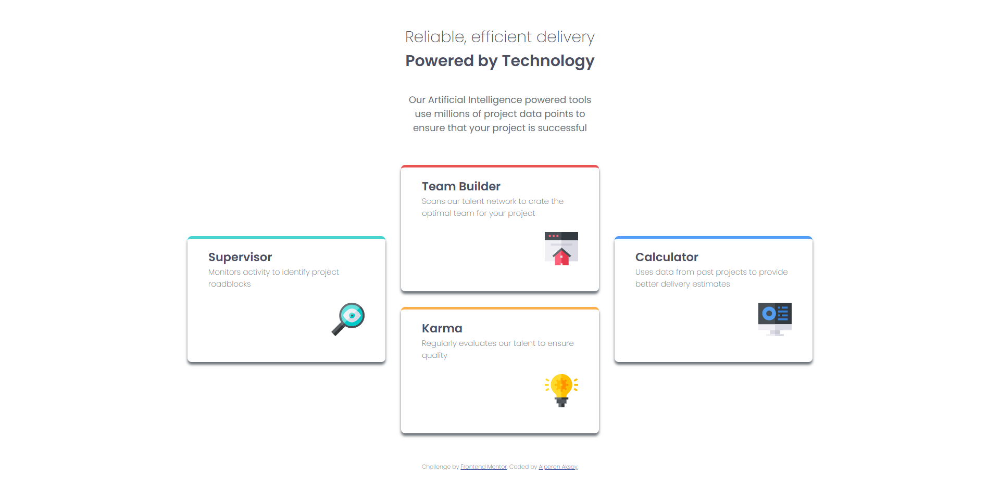

# Frontend Mentor - Four card feature section solution

This is a solution to the [Four card feature section challenge on Frontend Mentor](https://www.frontendmentor.io/challenges/four-card-feature-section-weK1eFYK). Frontend Mentor challenges help you improve your coding skills by building realistic projects. 

## Table of contents

- [Overview](#overview)
  - [The challenge](#the-challenge)
  - [Screenshot](#screenshot)
  - [Links](#links)
- [My process](#my-process)
  - [Built with](#built-with)
  - [What I learned](#what-i-learned)
  - [Useful resources](#useful-resources)
- [Author](#author)

## Overview

### The challenge

Users should be able to:

- View the optimal layout for the site depending on their device's screen size

### Screenshot

### Links

- Solution URL: [https://github.com/aksoyalpi/four-card-feature-section](https://github.com/aksoyalpi/four-card-feature-section)
- Live Site URL: [https://aksoyalpi.github.io/four-card-feature-section/](https://aksoyalpi.github.io/four-card-feature-section/)

## My process

### Built with

- Semantic HTML5 markup
- CSS custom properties
- Flexbox
- CSS Grid
- Mobile-first workflow
- Sass

### What I learned

- CSS Grid
- Sass

### Useful resources

- [CSS Grid: Interactive Resource](https://www.joshwcomeau.com/css/interactive-guide-to-grid/) 
- [Learn CSS Grid with a game](https://cssgridgarden.com/) 

## Author

- Website - [Alperen Aksoy](https://alperenaksoy.de)

